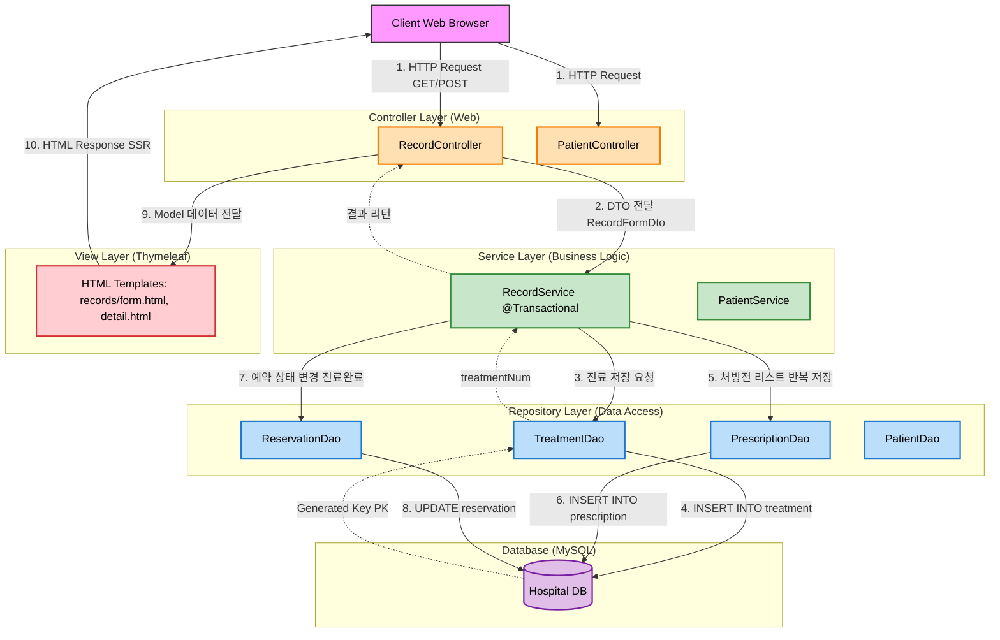

~~[# Hospital Management System Architecture

<!-- 
IntelliJ에서 Mermaid 다이어그램 미리보기 방법:

[Windows]
1. 마크다운 파일 열기
2. 미리보기: Ctrl + Shift + P
3. 편집기와 미리보기 나란히 보기: Ctrl + Shift + V (또는 우측 상단 미리보기 아이콘 클릭)

[Mac OS]
1. 마크다운 파일 열기
2. 미리보기: Cmd + Shift + P
3. 편집기와 미리보기 나란히 보기: Cmd + Shift + V (또는 우측 상단 미리보기 아이콘 클릭)

필수 플러그인:
- "Markdown" 플러그인 (기본 제공)
- "Mermaid" 플러그인 설치 권장 (File > Settings > Plugins 에서 "Mermaid" 검색 후 설치)

플러그인 설치 단축키:
- Windows: Ctrl + Alt + S > Plugins
- Mac: Cmd + , > Plugins
-->

## System Architecture Diagram

## Architecture Layers

### 1. Client Layer
- **Client Web Browser**: 사용자 인터페이스, HTTP 요청 송신

### 2. Controller Layer (Web)
- **RecordController**: 진료 기록 관련 HTTP 요청 처리
- **PatientController**: 환자 정보 관련 HTTP 요청 처리

### 3. Service Layer (Business Logic)
- **RecordService**: 진료 기록 비즈니스 로직 처리 (트랜잭션 관리)
- **PatientService**: 환자 정보 비즈니스 로직 처리

### 4. Repository Layer (Data Access)
- **TreatmentDao**: 진료 데이터 접근
- **PrescriptionDao**: 처방전 데이터 접근
- **ReservationDao**: 예약 데이터 접근
- **PatientDao**: 환자 데이터 접근

### 5. Database Layer
- **Hospital DB (MySQL)**: 병원 관리 시스템 데이터베이스

### 6. View Layer (Thymeleaf)
- **HTML Templates**: 서버 사이드 렌더링 템플릿

## Data Flow Process

1. **Client Request**: 클라이언트가 HTTP 요청 전송
2. **Controller**: DTO를 Service로 전달
3. **Service**: 비즈니스 로직 수행 및 트랜잭션 시작
4. **DAO**: 데이터베이스 CRUD 작업 수행
5. **Database**: 데이터 저장 및 조회
6. **Response**: View를 통해 클라이언트에 응답 반환

---

**Note**: 실선 화살표는 요청 흐름, 점선 화살표는 응답 흐름을 나타냅니다.]()~~