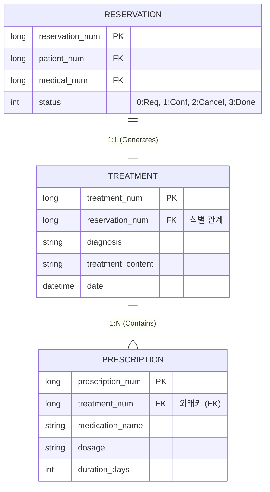
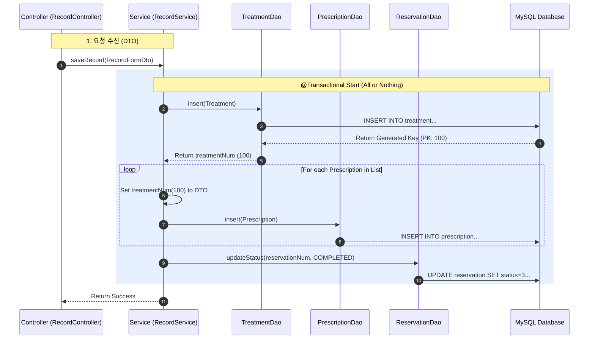

# Data Structure & Transaction Flow

## Entity Relationship Diagram (ERD)
진료(Treatment)와 처방(Prescription)의 **1:N 관계**와, 예약(Reservation)과의 **1:1 식별 관계**를 시각화했습니다.

## Transaction Flow
진료 기록 저장 시, 트랜잭션이 어떻게 관리되는지 단계별로
시퀀스 다이어그램으로 나타냈습니다.

